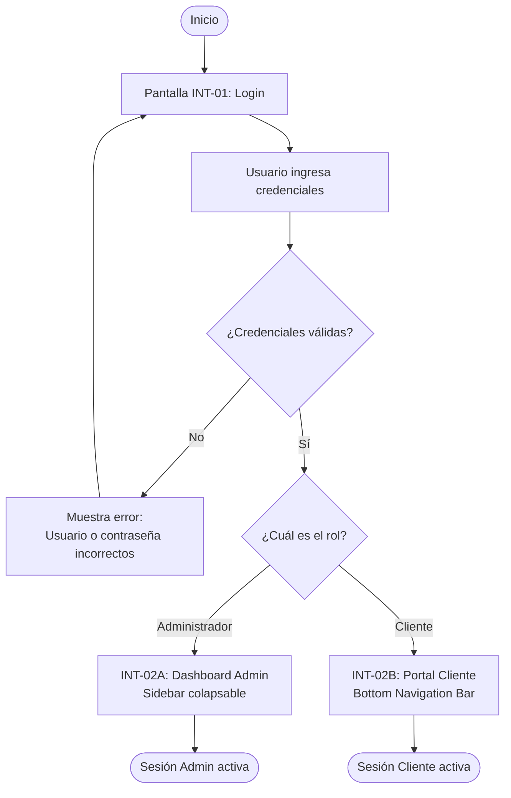
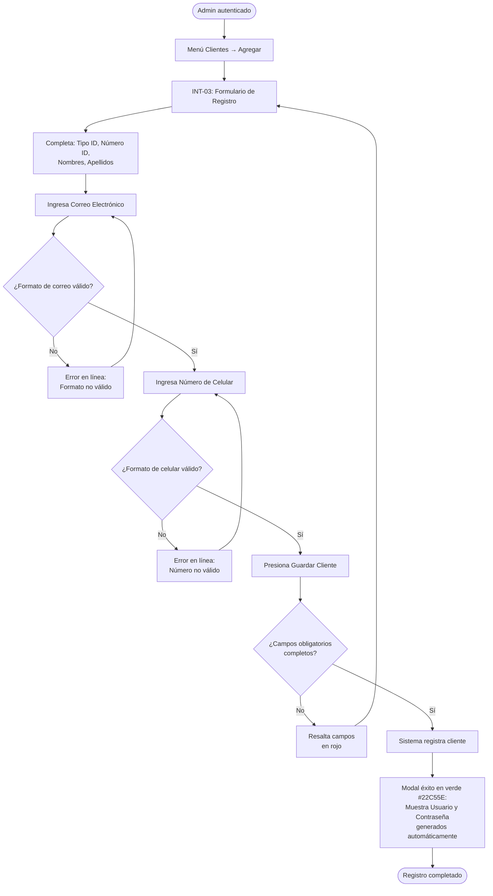
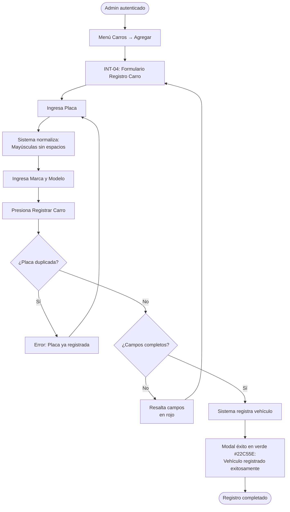
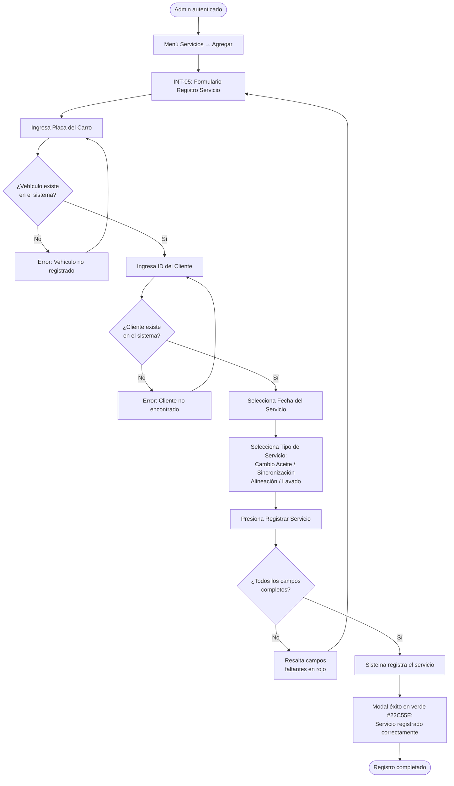
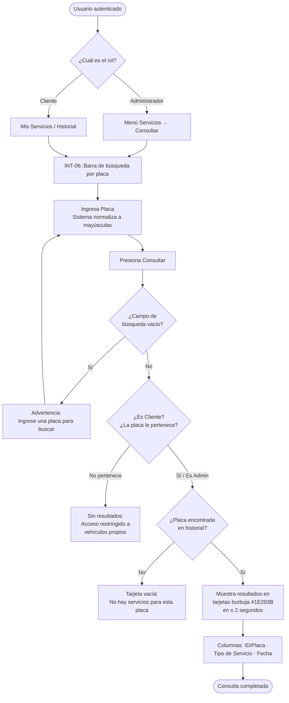
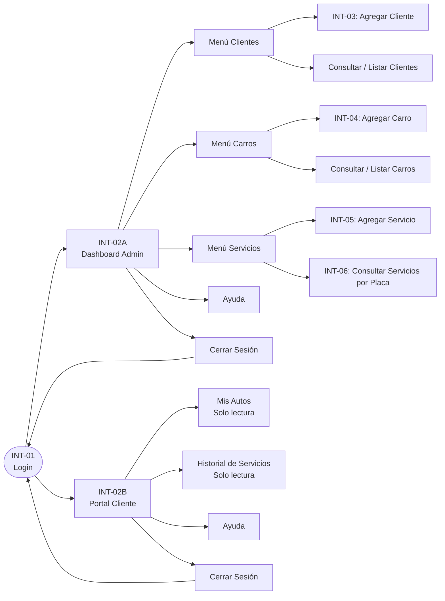

# Documento de Requerimientos — Serviteca ADSO

**Proyecto:** Aplicación Web Serviteca ADSO  
**Programa:** Tecnólogo en Análisis y Desarrollo de Software (ADSO) — SENA  
**Fase:** Maquetación e Interfaz Gráfica de Usuario  
**Fuente base:** `docs/REQUERIMIENTOS_BASE.md` (origen: `Requerimientos_serviteca.xlsx`)

---

## Tabla de Contenido

1. [Alcance y Fuera de Alcance](#1-alcance-y-fuera-de-alcance)
2. [Requerimientos Funcionales](#2-requerimientos-funcionales)
3. [Requerimientos No Funcionales](#3-requerimientos-no-funcionales)
4. [Casos de Uso](#4-casos-de-uso)
5. [Diagramas de Proceso](#5-diagramas-de-proceso)

---

## 1. Alcance y Fuera de Alcance

### 1.1 Dentro del Alcance (In Scope)

| Área | Descripción |
| :--- | :--- |
| **Maquetación responsiva** | Diseño Mobile-First adaptado a pantallas táctiles (~390px × 844px), escalable a escritorio. |
| **Tema Dark Mode** | Implementación completa de la paleta de colores oficial: `#0F0F10` (fondo), `#1E293B` (contenedores), `#FACC15` (acentos CTA), `#22C55E` (éxito/activo). |
| **Especificación visual UI/UX** | Guía de estilo con tipografía, componentes (tarjetas burbuja, botones táctiles, sidebar colapsable, bottom bar), y estados visuales. |
| **Flujo de navegación — Administrador** | Login → Dashboard Admin → Gestión de Clientes / Vehículos / Servicios → Consultas → Cierre de sesión. |
| **Flujo de navegación — Cliente** | Login → Portal Cliente (solo lectura) → Mis Autos → Historial de Servicios → Cierre de sesión. |
| **Prototipo interactivo frontend** | Aplicación React + TypeScript + Vite + Tailwind CSS v4 con datos demo en memoria. |

### 1.2 Fuera del Alcance (Out of Scope)

| Área excluida | Justificación |
| :--- | :--- |
| **Integración con backend / base de datos persistente** | Esta fase cubre únicamente el frontend y la especificación visual. |
| **API REST o GraphQL en producción** | No aplica en la fase de maquetación UI/UX. |
| **Autenticación real (JWT, OAuth, sesiones servidor)** | Las credenciales son datos demo en memoria para validación visual del flujo. |
| **Pasarelas de pago** | Fuera del dominio de una serviteca de mantenimiento vehicular en fase 1. |
| **Notificaciones push / correos electrónicos reales** | Los modales de confirmación son visuales; no hay envío real de correos. |
| **Rol de Empleado / Técnico** | El sistema en fase 1 reconoce únicamente Administrador y Cliente. |

---

## 2. Requerimientos Funcionales

| Código | Módulo | Nombre | Descripción Detallada |
| :--- | :--- | :--- | :--- |
| **RF-01** | Seguridad y Acceso | Autenticación y Control de Acceso | El sistema debe permitir el ingreso de usuarios (Administradores y Clientes) mediante un nombre de usuario y contraseña válidos. |
| **RF-02** | Gestión de Clientes | Registro de Clientes | El sistema debe permitir al Administrador registrar nuevos clientes capturando: Tipo de ID, Número de ID, Nombres, Apellidos, Correo Electrónico y Celular. |
| **RF-03** | Gestión de Vehículos | Registro de Vehículos | El sistema debe permitir registrar vehículos asociados a la serviteca ingresando: Placa, Marca y Modelo. |
| **RF-04** | Gestión de Servicios | Registro de Servicios Prestados | El sistema debe registrar un servicio realizado ingresando: Placa del vehículo, Identificación del cliente, Fecha del servicio y Tipo de servicio (Cambio de Aceite, Sincronización, Alineación, Lavado). |
| **RF-05** | Consultas y Reportes | Consulta e Historial de Servicios por Vehículo | El sistema debe permitir buscar un vehículo por su placa y desplegar el historial de servicios realizados (Placa, Servicio Prestado y Fecha). |
| **RF-06** | Seguridad y Acceso | Navegación Diferenciada por Rol | El sistema debe desplegar vistas y menús contextuales dependiendo del rol del usuario autenticado (Menú completo para Administrador y vista simplificada de consulta para Cliente). |
| **RF-07** | Navegación y Menús | Menú Navegación Principal (Administrador) | El sistema debe proveer una interfaz de navegación principal que contenga de forma visible las siguientes opciones y submenús:  • **Menú Clientes:** Opciones Agregar, Consultar y Listar.  • **Menú Carros:** Opciones Agregar, Consultar y Listar.  • **Menú Servicios:** Opciones Agregar, Consultar y Listar.  • **Menú Ayuda:** Opción de soporte/ayuda.  • **Menú Salir:** Opción de cierre de sesión seguro. |
| **RF-08** | Navegación y Menús | Menú Simplificado (Vista Cliente) | El sistema debe ofrecer una navegación simplificada e intuitiva restringida a las opciones de consulta del cliente:  • **Mis Autos:** Lista de vehículos del cliente.  • **Mis Servicios / Historial:** Lista de servicios recibidos.  • **Ayuda:** Guía de uso.  • **Salir:** Opción para cerrar sesión. |

---

## 3. Requerimientos No Funcionales

| Código | Categoría | Módulo | Nombre | Descripción Detallada |
| :--- | :--- | :--- | :--- | :--- |
| **RNF-01.1** | No Funcional | Seguridad | Enmascaramiento de Credenciales | Los campos de contraseña deben enmascarar los caracteres ingresados. |
| **RNF-01.2** | No Funcional | Usabilidad | Diseño de Tarjeta Login | El formulario de inicio de sesión debe estar alojado en una tarjeta central con contraste visual alto sobre un fondo oscuro (`#0F0F10`). |
| **RNF-02.1** | No Funcional | Rendimiento | Tiempo de Respuesta en Registro | Al guardar el cliente, el sistema debe confirmar el registro mediante un mensaje flotante (modal) en un tiempo no mayor a 1.5 segundos. |
| **RNF-02.2** | No Funcional | Calidad de Datos | Validación de Formularios | Los campos de correo electrónico y celular deben contar con validaciones de formato en tiempo real antes del envío. |
| **RNF-03.1** | No Funcional | Integridad de Datos | Normalización de Placas | La placa debe convertirse automáticamente a letras mayúsculas sin espacios. |
| **RNF-03.2** | No Funcional | Usabilidad | Diseño Responsivo Móvil | Los formularios deben adaptarse de forma fluida a pantallas táctiles de dispositivos móviles (marco aproximado de 390px × 844px). |
| **RNF-04.1** | No Funcional | Usabilidad / UX | Selección Guiada de Servicios | La selección del tipo de servicio debe realizarse mediante una lista desplegable o botones contextuales para minimizar errores. |
| **RNF-04.2** | No Funcional | Accesibilidad | Acceso Directo a Registro | El formulario debe estar accesible directamente desde el panel principal o menú de servicios. |
| **RNF-05.1** | No Funcional | Rendimiento | Velocidad de Búsqueda | Los resultados de la consulta de servicios deben mostrarse en menos de 2 segundos. |
| **RNF-05.2** | No Funcional | Interfaz de Usuario | Presentación en Tarjetas Burbuja | Los resultados deben presentarse en tarjetas con estilo contenedor redondeado ("burbujas") para facilitar la lectura en entornos móviles. |
| **RNF-06.1** | No Funcional | Seguridad | Control de Permisos por Rol | El cliente solo podrá visualizar información en modo de lectura de sus propios autos e historial de servicios. |
| **RNF-06.2** | No Funcional | Interfaz de Usuario | Estética y Tema Dark Mode | La interfaz debe implementar una guía de estilo coherente basada en el modo oscuro (Dark Mode) con acentos de color llamativos (Amarillo/Verde Neón) / (Azul, Verde Neón). |
| **RNF-07.1** | No Funcional | Usabilidad | Accesibilidad de Menú Admin | La barra de menú lateral (Sidebar) o barra inferior (Bottom Navigation Bar) debe ser colapsable y táctil, garantizando un acceso con máximo 2 toques/clics a cualquier submenú. |
| **RNF-07.2** | No Funcional | Interfaz de Usuario | Consistencia Visual en Menús | Las opciones activas del menú deben destacarse visualmente mediante resaltado en verde/amarillo brillante para orientar al usuario. |
| **RNF-08.1** | No Funcional | Seguridad | Restricción de Contenido en Cliente | El menú del cliente no debe renderizar ni permitir el acceso a opciones de registro o modificación de datos. |
| **RNF-08.2** | No Funcional | Usabilidad | Diseño Táctil Móvil | El menú del cliente debe implementarse prioritariamente como una barra inferior (Bottom Bar) para facilitar el uso con una sola mano en smartphones. |

---

## 4. Casos de Uso

### CU-01: Autenticación e Inicio de Sesión

| Campo | Detalle |
| :--- | :--- |
| **Identificador** | CU-01 |
| **Nombre** | Autenticación e Inicio de Sesión |
| **Actor(es)** | Administrador, Cliente |
| **Requerimiento relacionado** | RF-01, RF-06, RNF-01.1, RNF-01.2 |
| **Precondiciones** | El usuario conoce sus credenciales. El sistema está disponible y muestra la pantalla de login (INT-01). |
| **Postcondiciones** | El usuario queda autenticado y es redirigido al dashboard correspondiente a su rol. |

**Flujo Principal:**

| Paso | Actor | Acción |
| :---: | :--- | :--- |
| 1 | Sistema | Muestra la pantalla de login: tarjeta central flotante sobre fondo `#0F0F10`, campo Usuario, campo Contraseña (enmascarado), botón "Iniciar Sesión" (`#FACC15`). |
| 2 | Usuario | Ingresa su nombre de usuario en el campo correspondiente. |
| 3 | Usuario | Ingresa su contraseña (los caracteres se enmascaran en tiempo real — RNF-01.1). |
| 4 | Usuario | Presiona el botón "Iniciar Sesión". |
| 5 | Sistema | Valida las credenciales contra el registro de usuarios. |
| 6a | Sistema | **[Si es Administrador]** Redirige a INT-02A: Dashboard Admin con sidebar completo. |
| 6b | Sistema | **[Si es Cliente]** Redirige a INT-02B: Portal Cliente con bottom navigation bar (solo lectura). |

**Flujos de Excepción:**

| Código | Situación | Respuesta del sistema |
| :--- | :--- | :--- |
| E-01 | Credenciales incorrectas | Muestra mensaje de error en rojo dentro de la tarjeta: "Usuario o contraseña incorrectos." |
| E-02 | Campos vacíos al enviar | Resalta los campos vacíos con borde de error y bloquea el envío. |

---

### CU-02: Registro de Clientes y Generación de Credenciales

| Campo | Detalle |
| :--- | :--- |
| **Identificador** | CU-02 |
| **Nombre** | Registro de Clientes y Generación de Credenciales |
| **Actor(es)** | Administrador |
| **Requerimiento relacionado** | RF-02, RNF-02.1, RNF-02.2, RNF-03.2 |
| **Precondiciones** | El Administrador está autenticado. Navega a Menú Clientes → Agregar Cliente (INT-03). |
| **Postcondiciones** | El nuevo cliente queda registrado en el sistema. Se genera y muestra un modal con sus credenciales de acceso. |

**Flujo Principal:**

| Paso | Actor | Acción |
| :---: | :--- | :--- |
| 1 | Administrador | Selecciona "Agregar Cliente" desde el sidebar o panel de acceso rápido. |
| 2 | Sistema | Muestra INT-03: formulario de registro con los campos: Lista desplegable Tipo de Identificación, Número de Identificación, Nombres, Apellidos, Correo Electrónico, Número de Celular. |
| 3 | Administrador | Selecciona el Tipo de Identificación (CC, CE, TI, Pasaporte). |
| 4 | Administrador | Ingresa el Número de Identificación. |
| 5 | Administrador | Ingresa Nombres y Apellidos. |
| 6 | Administrador | Ingresa el Correo Electrónico — el sistema valida el formato en tiempo real (RNF-02.2). |
| 7 | Administrador | Ingresa el Número de Celular — el sistema valida el formato en tiempo real (RNF-02.2). |
| 8 | Administrador | Presiona el botón "Guardar Cliente" (`#FACC15`). |
| 9 | Sistema | Registra al cliente y en ≤ 1.5 s (RNF-02.1) despliega un modal de éxito (`#22C55E`) mostrando el Usuario y Contraseña generados automáticamente según las reglas de negocio. |
| 10 | Administrador | Cierra el modal. El sistema limpia el formulario para un nuevo registro. |

**Flujos de Excepción:**

| Código | Situación | Respuesta del sistema |
| :--- | :--- | :--- |
| E-01 | Correo electrónico con formato inválido | Muestra advertencia en línea: "Formato de correo no válido." Bloquea el envío. |
| E-02 | Celular con formato inválido | Muestra advertencia en línea: "Número de celular no válido." Bloquea el envío. |
| E-03 | Campos obligatorios vacíos | Resalta en rojo los campos faltantes y bloquea el envío. |

---

### CU-03: Registro de Vehículos

| Campo | Detalle |
| :--- | :--- |
| **Identificador** | CU-03 |
| **Nombre** | Registro de Vehículos |
| **Actor(es)** | Administrador |
| **Requerimiento relacionado** | RF-03, RNF-03.1, RNF-03.2 |
| **Precondiciones** | El Administrador está autenticado. Navega a Menú Carros → Agregar Carro (INT-04). |
| **Postcondiciones** | El vehículo queda registrado en el sistema y aparece en el listado de vehículos. |

**Flujo Principal:**

| Paso | Actor | Acción |
| :---: | :--- | :--- |
| 1 | Administrador | Selecciona "Agregar Carro" desde el sidebar. |
| 2 | Sistema | Muestra INT-04: formulario con los campos Placa, Marca y Modelo. |
| 3 | Administrador | Ingresa la Placa del vehículo. El sistema normaliza automáticamente a mayúsculas sin espacios (RNF-03.1). |
| 4 | Administrador | Ingresa la Marca del vehículo. |
| 5 | Administrador | Ingresa el Modelo del vehículo. |
| 6 | Administrador | Presiona el botón "Registrar Carro" (`#FACC15`). |
| 7 | Sistema | Valida los datos, registra el vehículo y muestra un modal de confirmación en verde (`#22C55E`): "Vehículo registrado exitosamente." |

**Flujos de Excepción:**

| Código | Situación | Respuesta del sistema |
| :--- | :--- | :--- |
| E-01 | Placa duplicada | Muestra error: "Esta placa ya se encuentra registrada en el sistema." |
| E-02 | Campos obligatorios vacíos | Resalta en rojo los campos faltantes y bloquea el envío. |

---

### CU-04: Registrar Servicio Prestado

| Campo | Detalle |
| :--- | :--- |
| **Identificador** | CU-04 |
| **Nombre** | Registrar Servicio Prestado |
| **Actor(es)** | Administrador |
| **Requerimiento relacionado** | RF-04, RNF-04.1, RNF-04.2, RNF-03.1 |
| **Precondiciones** | El Administrador está autenticado. El vehículo y el cliente referenciados deben existir en el sistema. Navega a Menú Servicios → Agregar Servicio (INT-05). |
| **Postcondiciones** | El servicio queda registrado y asociado al vehículo y al cliente. Aparece en el historial de consultas. |

**Flujo Principal:**

| Paso | Actor | Acción |
| :---: | :--- | :--- |
| 1 | Administrador | Selecciona "Agregar Servicio" desde el sidebar o acceso directo (RNF-04.2). |
| 2 | Sistema | Muestra INT-05: formulario con los campos Placa del Carro, Identificación del Cliente, Fecha del Servicio y Tipo de Servicio. |
| 3 | Administrador | Ingresa la Placa del Carro. El sistema normaliza a mayúsculas sin espacios (RNF-03.1). |
| 4 | Administrador | Ingresa la Identificación del Cliente. |
| 5 | Administrador | Selecciona la Fecha del Servicio mediante el selector de fecha. |
| 6 | Administrador | Selecciona el Tipo de Servicio desde la lista desplegable o botones contextuales (RNF-04.1): Cambio de Aceite, Sincronización, Alineación, Lavado. |
| 7 | Administrador | Presiona el botón "Registrar Servicio" (`#FACC15`). |
| 8 | Sistema | Valida los datos, registra el servicio y muestra modal de éxito (`#22C55E`): "Servicio registrado correctamente." |

**Flujos de Excepción:**

| Código | Situación | Respuesta del sistema |
| :--- | :--- | :--- |
| E-01 | Placa no encontrada en el sistema | Muestra error: "El vehículo con esta placa no está registrado." |
| E-02 | ID de cliente no encontrado | Muestra error: "No se encontró un cliente con esta identificación." |
| E-03 | Fecha no seleccionada | Resalta el selector en rojo y bloquea el envío. |
| E-04 | Tipo de servicio no seleccionado | Muestra advertencia: "Seleccione un tipo de servicio." Bloquea el envío. |

---

### CU-05: Consulta e Historial de Servicios por Placa

| Campo | Detalle |
| :--- | :--- |
| **Identificador** | CU-05 |
| **Nombre** | Consulta e Historial de Servicios por Placa |
| **Actor(es)** | Administrador, Cliente |
| **Requerimiento relacionado** | RF-05, RF-06, RNF-05.1, RNF-05.2, RNF-06.1 |
| **Precondiciones** | El usuario está autenticado. Para el Cliente, el vehículo debe estar vinculado a su perfil. |
| **Postcondiciones** | Se muestra la lista de servicios del vehículo en tarjetas burbuja. |

**Flujo Principal:**

| Paso | Actor | Acción |
| :---: | :--- | :--- |
| 1 | Usuario | Navega a la sección de Consulta de Servicios (Admin: Menú Servicios → Consultar / Cliente: Mis Servicios). |
| 2 | Sistema | Muestra INT-06: barra de búsqueda "Ingrese la Placa del Carro" y botón "Consultar". |
| 3 | Usuario | Ingresa la placa del vehículo. El sistema normaliza a mayúsculas (RNF-03.1). |
| 4 | Usuario | Presiona "Consultar". |
| 5 | Sistema | Busca y retorna los resultados en ≤ 2 segundos (RNF-05.1). |
| 6 | Sistema | Muestra el historial en tarjetas burbuja redondeadas (RNF-05.2) con columnas: ID Auto / Placa, Tipo de Servicio, Fecha del Servicio. |

**Flujos de Excepción:**

| Código | Situación | Respuesta del sistema |
| :--- | :--- | :--- |
| E-01 | Placa no encontrada | Muestra tarjeta de estado vacío: "No se encontraron servicios para esta placa." |
| E-02 | Campo de búsqueda vacío | Bloquea la consulta y muestra: "Ingrese una placa para buscar." |
| E-03 | Cliente intenta consultar placa de otro cliente | El sistema filtra los resultados y solo retorna los vehículos vinculados al cliente autenticado (RNF-06.1). |

---

## 5. Diagramas de Proceso

### 5.1 Flujo de Autenticación y Enrutamiento por Rol (CU-01)

---

### 5.2 Flujo de Registro de Cliente y Generación de Credenciales (CU-02)

---

### 5.3 Flujo de Registro de Vehículo (CU-03)

---

### 5.4 Flujo de Registro de Servicio Prestado (CU-04)

---

### 5.5 Flujo de Consulta e Historial de Servicios por Placa (CU-05)

---

### 5.6 Mapa de Navegación General del Sistema

---

*Documento generado con asistencia de Kiro (Amazon AI) — Programa ADSO, SENA Colombia.*
